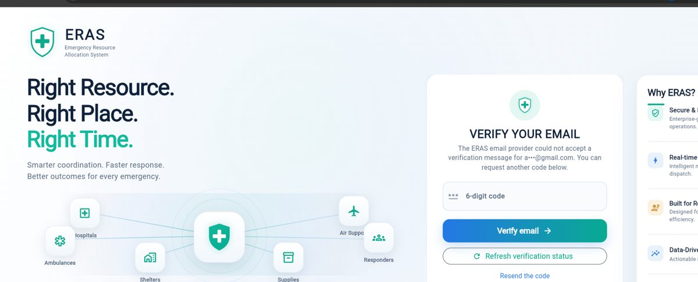
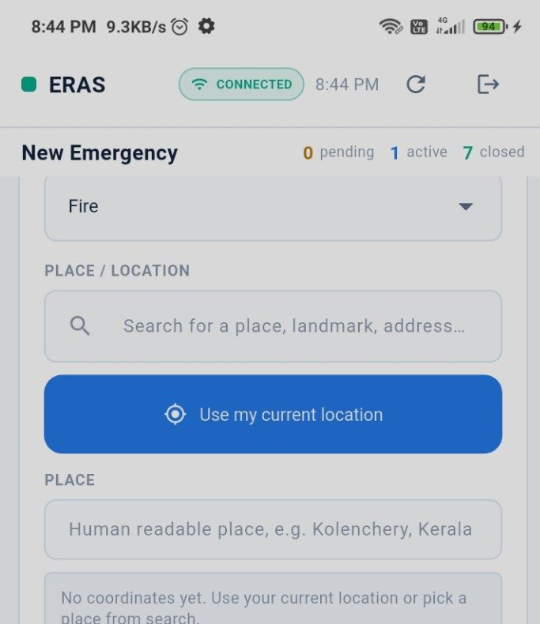
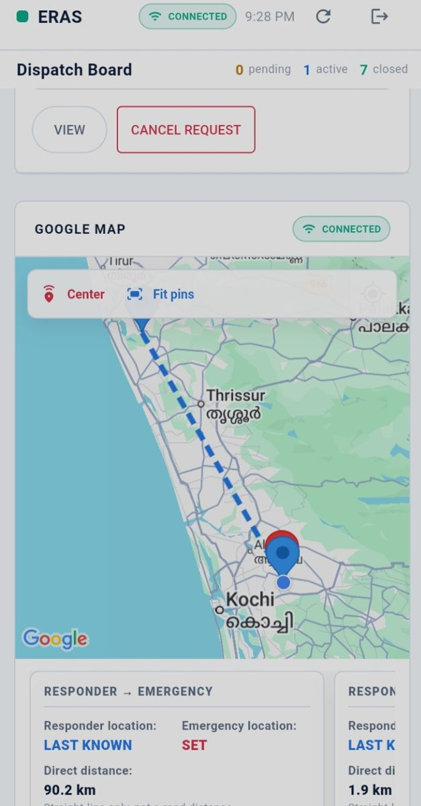
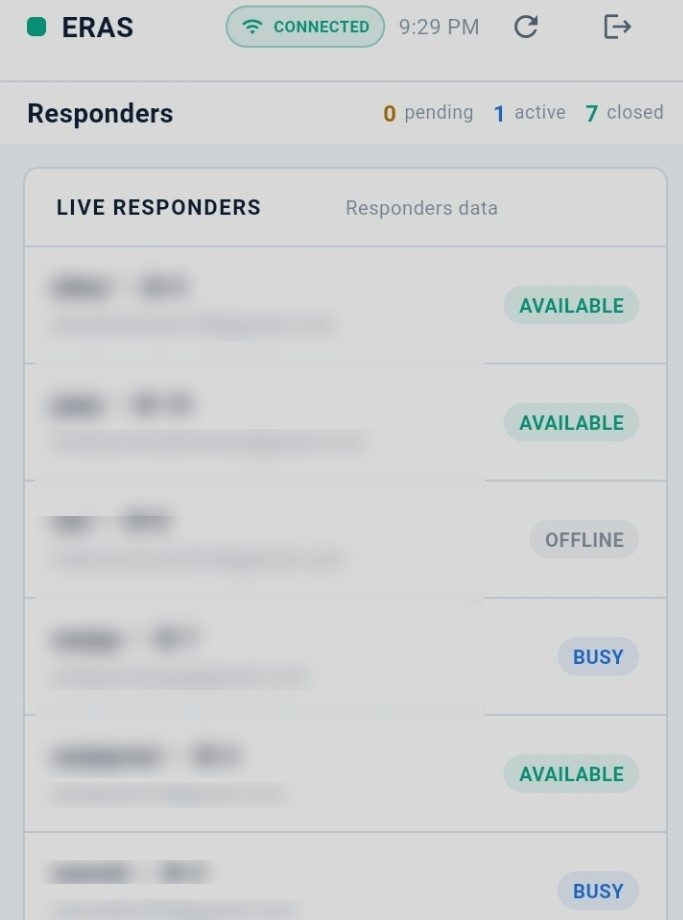
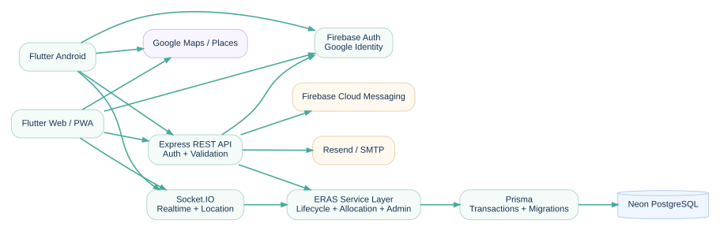

# ERAS — Emergency Resource Allocation System

**Right Resource. Right Place. Right Time.**

ERAS is a real-time emergency coordination platform that connects the people requesting help (REQUESTER), the responders providing it (RESPONDER) and the administrators overseeing operations (ADMIN). It carries an emergency through one operational workflow — request, matching, acceptance, allocation, dispatch, live tracking and delivery — instead of spreading it across phone calls, chat groups and spreadsheets. The production system is a Flutter (Web + Android) client, an Express + Socket.IO API and a PostgreSQL database, released as `v1.0.0-production`.

| Production surface | URL |
| :--- | :--- |
| **Web application** | [eras.website](https://eras.website) |
| **Firebase Hosting** | [eras-production-f3ce6.web.app](https://eras-production-f3ce6.web.app) |
| **API health check** | [eras-api-sdjo.onrender.com/health](https://eras-api-sdjo.onrender.com/health) |
| **Production release** | `v1.0.0-production` |

---

## Visual showcase

<p align="center">
  
  <br>
  <sub><b>Authentication</b> — branded sign-in shell, email verification and password reset.</sub>
</p>

| Emergency Request | Live Dispatch &amp; Map | Responder Operations |
| :---: | :---: | :---: |
|  |  |  |
| <sub>Requester files an emergency with category, priority, location and required resources.</sub> | <sub>Dispatch board and operational map with live responder positions.</sub> | <sub>Responder readiness, availability state and live operational status.</sub> |

<sub>These are cropped, redacted copies of real ERAS screens with identifying account data blurred for presentation use.</sub>

---

## The value proposition

> **ERAS turns an emergency from a request into a coordinated operational workflow:**
> `Request → Match → Accept → Allocate → Dispatch → Track → Deliver → Complete`

---

## Problem and solution

Emergency coordination commonly breaks down for operational reasons rather than technical ones:

| Problem | How ERAS addresses it |
| :--- | :--- |
| Coordination is fragmented across calls, messages and informal channels | One role-based system holds requests, responders and resources together |
| Resource availability is not visible when a decision is needed | Responders publish availability, help types and resource capabilities |
| Realtime operational awareness is missing | Socket.IO publishes status, assignment and responder location updates |
| Emergency context is scattered across tools | Requests, resources, location and lifecycle state live in one record |
| History is hard to reconstruct afterwards | Assignments, allocations and audit entries are persisted |

ERAS centralises emergency requests, responders, resources, location and lifecycle management in a single operational platform. It does not replace emergency services — it coordinates the resources that are registered in the system.

---

## Core features

| Area | Capabilities |
| :--- | :--- |
| Authentication | Email/password sign-up and sign-in, email verification, Google/Firebase sign-in |
| Password management | Password reset with 6-digit one-time codes, resend cooldown and code expiry |
| Roles | REQUESTER, RESPONDER and ADMIN with role-based routing and server-side authorization |
| Emergency requests | Category, priority, description, place search or current location, required resources |
| Emergency taxonomy | Categories (fire, medical, accident, flood, rescue, other) and LOW → CRITICAL priority |
| Request expiry | Unattended requests expire automatically using category and priority windows |
| Resource availability | AVAILABLE / BUSY / UNAVAILABLE states with responder capability configuration |
| Resource model | SERVICE (reusable capability) and CONSUMABLE (inventory quantity) resources |
| Responder network | Availability and help types, resource inventory, assignments, accept and join |
| Realtime updates | Socket.IO status, assignment, allocation and responder location events |
| Live location | Responder position publishing with authenticated, room-scoped updates |
| Maps and location | Google Maps, place search, current location, reverse geocoding, direct-distance view |
| Allocation lifecycle | RESERVED → DISPATCHED → DELIVERED, plus cancellation and received confirmation |
| Operations | Multi-responder assignments, partial allocation and delivery-based completion |
| Admin console | User management, account activation/deactivation, operational history, audit log access |
| Audit and history | Append-only audit entries recording actor, role and IP for administrative actions |
| Email notifications | Verification, welcome and password-reset email through Resend with SMTP fallback |
| Push notifications | Firebase Cloud Messaging support for responders without an active socket session |
| Security controls | JWT sessions, role checks, rate limits, security headers, validation, hashed one-time codes |
| Production deployment | Flutter Web on Firebase Hosting, Express + Socket.IO on Render, PostgreSQL on Neon |

---

## How ERAS works

```text
Requester
   │
   ▼
Create Emergency
   │
   ▼
Resource Matching
   │
   ▼
Responder Accepts
   │
   ▼
Allocation
   │
   ▼
Dispatch
   │
   ▼
Realtime Tracking
   │
   ▼
Delivery
   │
   ▼
Completion
```

| Stage | Actor | What happens |
| :--- | :--- | :--- |
| Requester | REQUESTER | Signs in and reaches the requester workspace |
| Create Emergency | REQUESTER | Files an emergency with category, priority, location and required resources |
| Resource Matching | Backend | Evaluates compatible responders, help types and resource availability |
| Responder Accepts | RESPONDER | Accepts or joins the emergency from the dispatch board |
| Allocation | RESPONDER | Resources are allocated — SERVICE capability or CONSUMABLE quantity |
| Dispatch | RESPONDER | Allocation moves from RESERVED to DISPATCHED |
| Realtime Tracking | Both | Socket.IO publishes status and responder location updates |
| Delivery | RESPONDER | Allocation is marked DELIVERED, with quantity confirmation |
| Completion | Backend | The request completes once required delivered quantities are satisfied |

---

## Architecture

<p align="center">
  
</p>

```text
Flutter Web / Android  →  Express REST API + Socket.IO  →  Prisma  →  Neon PostgreSQL
```

Supporting services: Firebase Auth and Hosting, Google Maps / Places, email delivery (Resend with SMTP fallback) and Firebase Cloud Messaging.

The backend owns the operational rules — authentication, role enforcement, emergency lifecycle, allocation transactions, resource availability and responder state — while Prisma and PostgreSQL remain the source of truth.

Full runtime topology, layer responsibilities and domain rules: **[`docs/ARCHITECTURE.md`](docs/ARCHITECTURE.md)**.

---

## Technology stack

| Layer | Technology |
| :--- | :--- |
| **Frontend** | Flutter (Dart) targeting Web/PWA and Android — `socket_io_client`, `google_maps_flutter`, `geolocator`, `http` |
| **Backend** | Node.js 22 with Express 5 REST API, modular routes, controllers, services and domain layer |
| **Database** | PostgreSQL (Neon) accessed through Prisma ORM with versioned migrations and seed script |
| **Realtime** | Socket.IO 4 — JWT-authenticated connections and authorized operational rooms |
| **Authentication** | Email/password with bcrypt hashing, JWT application sessions, Firebase/Google identity |
| **Maps / Location** | Google Maps Flutter, Google Places search, Geolocator and reverse geocoding |
| **Cloud / Hosting** | Firebase Hosting (Flutter Web), Render (Express + Socket.IO), Neon (PostgreSQL) |
| **Email** | Resend HTTPS API with SMTP fallback through Nodemailer |
| **Push Notifications** | Firebase Cloud Messaging (HTTP v1) for responders without an active socket session |
| **Testing** | Jest + Supertest (backend), `flutter_test` (client), GitHub Actions CI workflows |

---

## Role-based experience

### 🙋 REQUESTER

- Creates emergency requests with category, priority and description.
- Selects the location through place search or the current position.
- Chooses the required resources for the emergency.
- Tracks the request through its full lifecycle and can cancel it.

### 🚑 RESPONDER

- Sets availability and selects the help types they can serve.
- Configures resource capabilities and inventory through the readiness screen.
- Accepts or joins compatible emergencies from the dispatch board.
- Publishes realtime status and live location while working.
- Handles allocation — reserve, dispatch and deliver resources.

### 🛡️ ADMIN

- Manages users, roles and account details.
- Activates or deactivates accounts.
- Reviews active requests, assignments and allocations.
- Reviews operational history and audit log entries, and performs administrative controls.

---

## Resource model

| Mode | Meaning | Allocation behaviour |
| :--- | :--- | :--- |
| **SERVICE** | A reusable responder capability — for example an ambulance, rescue resource or volunteer | Allocated as a capability; it is not depleted when used |
| **CONSUMABLE** | An inventory-backed item — for example blood, oxygen, water or medicine | Quantity-constrained; allocation, delivery and cancellation follow transactional rules |

Responders enable the resources they can provide. When an emergency is allocated, SERVICE resources are matched against the responder's enabled capabilities, while CONSUMABLE resources are drawn against the recorded inventory quantity. A request is completed only when the required quantities actually reach DELIVERED.

---

## Security

Verified controls present in the repository:

- **JWT-based sessions** — the API issues the application session token; Socket.IO authenticates with the same token.
- **Server-side authorization** — every protected route resolves the current user, role and account state on the server.
- **Role checks** — REQUESTER, RESPONDER and ADMIN access is enforced by middleware, not by the client.
- **Email verification** — verification codes confirm ownership of a newly registered email address.
- **Hashed one-time codes** — verification and reset codes are generated with a CSPRNG, stored only as bcrypt hashes, single-use, time-limited and attempt-limited.
- **Rate limiting** — dedicated limits for authentication, Google sign-in, password reset, email resend, sensitive admin actions and general API traffic.
- **Security headers** — Helmet plus an explicit CSP/HSTS/nosniff/frame/referrer/permissions contract.
- **Input validation** — request payloads are validated and normalised on the server before they reach the database.
- **Audit logging** — administrative actions are recorded append-only with actor identity, role and IP.
- **Secret hygiene** — production secrets stay outside Git and are supplied by the deployment environment; browser Maps credentials are referrer-restricted.
- **Least-privilege registration** — public registration is limited to operational roles; ADMIN accounts are provisioned separately.

---

## Demo flow

The recommended walkthrough order is:

> **Recommended demo order** — Requester → Emergency → Responder → Accept → Allocation → Map → Delivery → Admin

1. Sign in as REQUESTER and create an emergency.
2. Show the request on the dispatch board.
3. Switch to RESPONDER, set readiness and become AVAILABLE.
4. Accept the compatible emergency.
5. Allocate resources and explain SERVICE versus CONSUMABLE.
6. Show the live map with emergency and responder context.
7. Move the allocation to DELIVERED and complete the request.
8. Close on the ADMIN console — users, accounts, history and audit.

A 5–7 minute script with timings and presenter notes: **[`docs/PRESENTATION.md`](docs/PRESENTATION.md)**.

---

## Installation

**Backend** — requires Node.js 22, PostgreSQL and npm.

```bash
cd backend
npm ci
cp .env.example .env      # then fill in local development values
npx prisma generate
npx prisma migrate deploy
npm test
npm start
```

**Flutter client** — requires the Flutter SDK with a Web or Android toolchain.

```bash
cd frontend/emergency_app
flutter pub get
flutter analyze
flutter test
flutter run -d chrome     # or: flutter run -d <android-device>
```

Point the client at a local API with `--dart-define=ERAS_API_BASE_URL=http://localhost:5000/api`.

---

## Production deployment

| Component | Platform | Notes |
| :--- | :--- | :--- |
| Flutter Web | Firebase Hosting | Project `eras-production-f3ce6`, custom domain `eras.website` |
| Express REST + Socket.IO | Render | Service definition in `render.yaml`, health check `/health` |
| PostgreSQL | Neon | Managed database reached through `DATABASE_URL` |

Deployment helpers already in the repository:

- `frontend/emergency_app/tool/build_production_web.sh` — validates the production `ERAS_*` variables and produces the release web bundle.
- `frontend/emergency_app/tool/deploy_firebase_web.sh` — builds and deploys the web bundle to Firebase Hosting.
- `frontend/emergency_app/tool/build_release_apk.sh` — validates production configuration and produces the release Android APK.
- `backend/scripts/verify-schema.js` and `backend/scripts/provision-admin.js` — schema verification and controlled admin provisioning.

```bash
cd frontend/emergency_app
./tool/deploy_firebase_web.sh          # build + firebase deploy --only hosting
./tool/build_release_apk.sh            # release Android APK
```

Deployment order, secret handling, Maps/Firebase setup and the ordered smoke test: **[`PRODUCTION_DEPLOYMENT.md`](PRODUCTION_DEPLOYMENT.md)**.

---

## Testing

| Suite | Location | Coverage |
| :--- | :--- | :--- |
| Backend | `backend/tests/` | 57 Jest + Supertest files: auth, authorization, lifecycle, allocation, dispatch, concurrency, realtime, security, validators |
| Client | `frontend/emergency_app/test/` | 54 `flutter_test` files including an end-to-end workflow test and UI behaviour tests |
| CI | `.github/workflows/` | Backend workflow (PostgreSQL service, migrations, schema verification, dependency audit, tests) and Flutter workflow (format, analyze, loader checks, tests, release web build) |

```bash
cd backend && npm test                 # migrations + schema check + Jest suites
cd frontend/emergency_app && flutter test
```

Physical-device checks that automated suites cannot cover — GPS permissions, live Maps rendering, background location and reconnect behaviour — are listed in **[`MANUAL_ACCEPTANCE_CHECKLIST.md`](MANUAL_ACCEPTANCE_CHECKLIST.md)**.

---

## Project structure

```text
backend/
  prisma/                 # schema, migrations, seed
  src/                    # routes, controllers, services, domain, realtime, middleware
  scripts/                # schema verification, admin provisioning, performance smoke
  tests/                  # Jest + Supertest suites
frontend/
  emergency_app/          # Flutter application (Web / PWA / Android)
    lib/                  # screens, widgets, models, services, theme
    test/                 # widget, UI behaviour and workflow tests
    tool/                 # production build, deploy and verification scripts
docs/
  ARCHITECTURE.md         # runtime topology, layers, domain rules
  PRESENTATION.md         # demo script
  architecture.svg        # architecture diagram
  screenshots/            # presentation screenshots
render.yaml               # Render service definition
README.md
```

---

## Engineering documentation

Detailed engineering history is kept in the repository for traceability — start here:

| Document | Contents |
| :--- | :--- |
| [`FINAL_REPORT.md`](FINAL_REPORT.md) | SERVICE/CONSUMABLE resource modes, responder availability lifecycle and acceptance results |
| [`PRODUCTION_DEPLOYMENT.md`](PRODUCTION_DEPLOYMENT.md) | Neon, Render, Firebase Hosting/Auth, Google Maps, Android release and smoke test |
| [`PRODUCTION_ACCEPTANCE_REPORT.md`](PRODUCTION_ACCEPTANCE_REPORT.md) | Google Sign-In production readiness and secrets audit |
| [`SECURITY_HARDENING_REPORT.md`](SECURITY_HARDENING_REPORT.md) | RBAC, privacy, request expiry and hardening audit |
| [`docs/ARCHITECTURE.md`](docs/ARCHITECTURE.md) | Runtime topology, layer responsibilities, domain rules and security boundaries |
| [`docs/PRESENTATION.md`](docs/PRESENTATION.md) | 5–7 minute demo flow and presentation priorities |

---

## Release

```text
v1.0.0-production
```

This tag is the **production release reference** for ERAS. It marks the baseline that the deployed Firebase Hosting, Render and Neon environments were built from, and it should be treated as the reference point for demos and regression checks.
