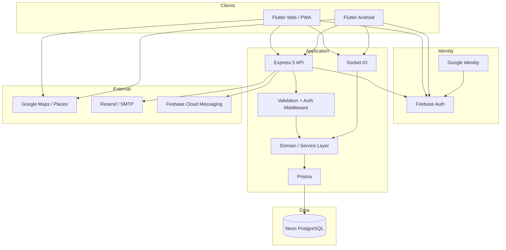

# ERAS Architecture

## Runtime topology



## Responsibility by layer

| Layer | Responsibility |
|---|---|
| Flutter UI | Authentication, emergency creation, responder readiness, dispatch board, resource/admin panels, maps and lifecycle actions |
| Client services | REST calls, Socket.IO, session persistence, location, Firebase/Google auth and push registration |
| Express routes/controllers | HTTP contract, authentication, role enforcement, input validation and response shaping |
| Backend services | Emergency lifecycle, allocation, resource availability, responder state, email, admin operations and audit logging |
| Socket.IO | Authorized realtime rooms, connection state, operational status and live responder location |
| Prisma | PostgreSQL access, transactions, migrations and relation mapping |
| PostgreSQL | Source of truth for users, emergencies, resources, responders, allocations, assignments, audit logs and auth codes |

## Operational flow

```text
Requester
  |
  +-- create emergency --> REST API --> validate --> persist
                                  |
                                  +--> resource availability
                                  |
                                  +--> realtime publication
                                             |
Responder <---- compatible requests / status ---- Socket.IO
  |
  +-- accept / join
  +-- provide location
  +-- dispatch resources
  |
  v
Backend lifecycle
  |
  +-- allocation transaction
  +-- SERVICE rules
  +-- CONSUMABLE quantity rules
  +-- responder availability sync
  +-- completion calculation
  |
  v
Neon PostgreSQL
```

## Key domain rules

**SERVICE resources** are reusable responder capabilities and are not depleted when allocated.

**CONSUMABLE resources** are inventory-backed and quantity constrained. Allocation and cancellation follow transactional quantity rules.

**Responder availability** is authoritative in the backend: unfinished work or outstanding RESERVED/DISPATCHED allocations keep a responder BUSY; AVAILABLE requires an active responder with usable enabled capability; otherwise the responder is OFFLINE.

**Request completion** requires the required quantities to actually reach DELIVERED.

## Security boundaries

- Firebase/Google establishes external identity.
- ERAS issues the application JWT session.
- Authorization uses current role/account state.
- Password/reset-code handling remains server-side.
- Production secrets are supplied through deployment environments/local secret files.
- Socket.IO access is authenticated and scoped to authorized operational rooms.
